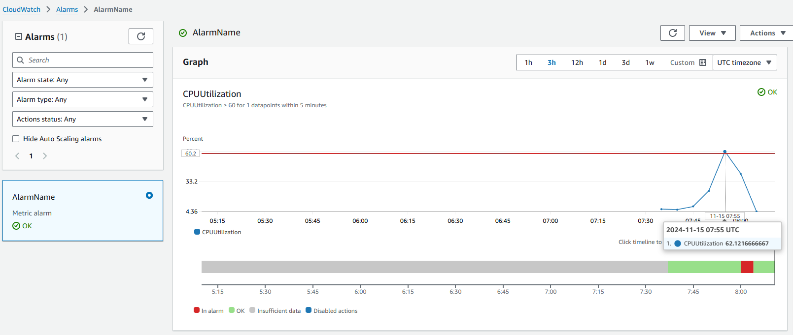

# Monitor & Notification Lab

- 過去一周 EC2 的 CPUUtilization metrics
<br>

- 安裝`stress-ng`前先清一下記憶體 (移除largeFile)
<br>

- 使用`stress-ng --cpu $(nproc) --timeout 5m`測試 (使用所有CPU + 5分鐘限制)
<br>

- 開始測試前的 CPUUtilization metrics
<br>

- 測試後的 CPUUtilization metrics
<br>

- CloudWatch Alarm 圖表裡面顯示在 11/15 07:55 UTC 的時候超過設定的 60
<br>

- 收到 email 的 ALARM 通知
<br>


<br>

# 進階題

- 進階題的部分主要是照著GPT給的建議步驟去走, 然後參考一些網路上的資料
- 流程如下: 
    - 建立 DC 專屬的 SNS Trigger
    - 在 Lambda 中建立 function
    - 然後撰寫程式碼連到 DC 頻道的 Webhook
    - 最後在已經設定好的 alarm 的 SNS 目標那邊再加入新的 DC SNS Trigger

- Lambda Function 的流程圖和部分程式碼截圖
<br>
<br>

- DC 成功收到訊息的截圖
<br>

- AWS CloudWatch 裡 Lambda Function 的 log 截圖
<br>

- 最後附上 Lambda Function 的完整程式碼
```javascript
import https from 'https';

export const handler = async (event) => {
    // 解析來自 SNS 的訊息
    const snsMessage = event.Records[0].Sns;
    const message = snsMessage.Message;
    const subject = snsMessage.Subject || "AWS SNS Alert";

    // Discord Webhook URL
    const webhookURL = 'https://discord.com/api/webhooks/*****/*****';

    // 建構 Discord 訊息內容
    const discordPayload = JSON.stringify({
        username: 'AWS SNS Bot',
        content: `**Subject**: ${subject}\n**Message**: ${message}`
    });

    // 發送到 Discord 的請求設定
    const options = {
        hostname: 'discord.com',
        port: 443,
        path: `/api/webhooks/*****/*****`,
        method: 'POST',
        headers: {
            'Content-Type': 'application/json',
            'Content-Length': Buffer.byteLength(discordPayload)
        }
    };

    return new Promise((resolve, reject) => {
        const req = https.request(options, (res) => {
            let responseBody = '';
            res.on('data', (chunk) => responseBody += chunk);
            res.on('end', () => {
                if (res.statusCode === 204) {
                    console.log('Message sent to Discord successfully.');
                    resolve('Success');
                } else {
                    console.error('Failed to send message:', responseBody);
                    reject('Failed');
                }
            });
        });

        req.on('error', (e) => {
            console.error('Request error:', e);
            reject(e);
        });

        req.write(discordPayload);
        req.end();
    });
};
```


<br>

# 參考資料
* Cloudwatch + Alarm with EC2 CPU Utilization 測試小記: https://sakananote2.blogspot.com/2019/09/cloudwatch-alarm-with-ec2-cpu.html
* Automated CPU Stress Testing and Scaling on AWS EC2: A Robust Solution: https://medium.com/@abhisri784/automated-cpu-stress-testing-and-scaling-on-aws-ec2-a-robust-solution-c985ceb160d8
* AWS Lambda: Send a Message with Discord Webhooks: https://dev.to/josuebustos/aws-lambda-send-a-message-with-discord-webhooks-12fa
* GPT: https://chatgpt.com/